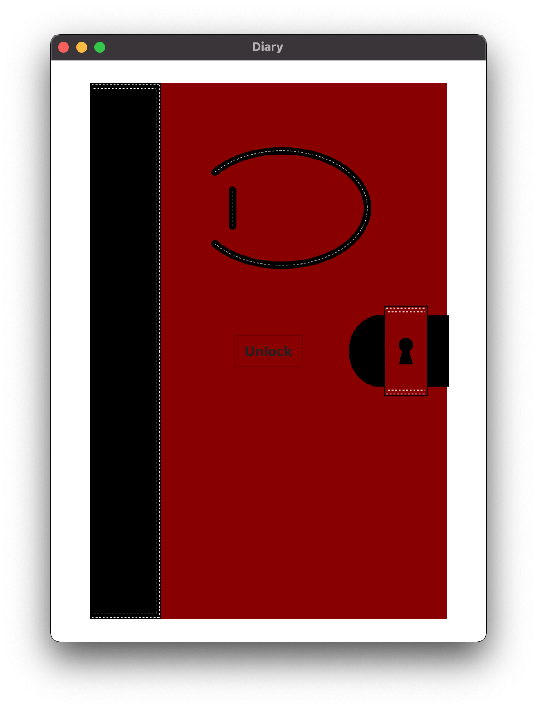
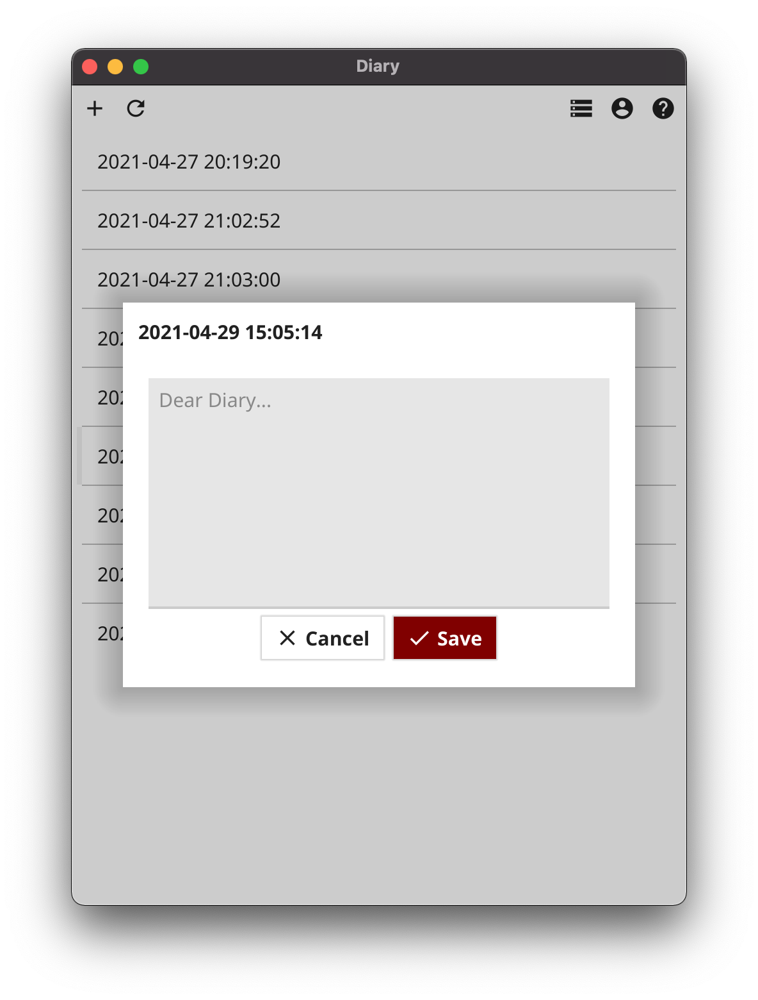

diarygo
=======

Diary is a personal journal written in Go that stores entries in S P A C E.

Diary provides two interfaces; a Command Line Interface, and a Graphical User Interface written with the [Fyne](https://fyne.io) toolkit.

# Command Line

## Installation

```
go get aletheiaware.com/diarygo/cmd/diary
```

## Usage

```
Diary Usage:
    diary - display usage
    diary add - add a new diary entry from stdin
    diary add [file] - add a new diary entry from file
    diary list - display all entries
    diary show - display latest entry
    diary show [id] - display entry with given id
```

# GUI





## Installation

```
go get fyne.io/fyne/v2/fyne
fyne get aletheiaware.com/diarygo/cmd/diaryfyne
```

## Usage

```
diaryfyne
```
